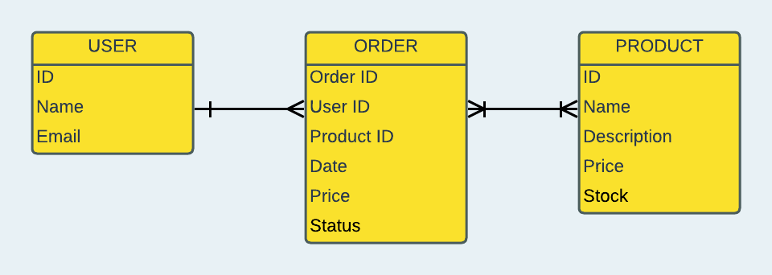

# Kurisoty Clothing Co (Backend API)
Kuriosity Clothing Co. is an apparel brand dedicated to kindling a sense of wonder. Through our unique t-shirt designs, we inspire a passion for exploring the boundless universe, both within oneself and in the cosmos. Join us on a journey of kuriosity and discovery, one shirt at a time.

# Overview
This README provides documentation for the backend API of our e-commerce application, which is built using Java with Spring Boot. The backend is responsible for handling user management, product catalog, shopping cart, orders, and more.

## ERD

## UserController
**User Management:**
- POST /api/users - Create a new user.
- GET /api/users/{id} - Get user by ID.
- GET /api/users - Get a list of all users.
- PUT /api/users/{id} - Update user information.
- DELETE /api/users/{id} - Delete a user.

**User Order Management:**
- GET /api/users/{userId}/orders - Get a list of orders for a specific user.
- POST /api/users/{userId}/orders - Create an order for a specific user.

## ProductController
**Product Management:**
- GET /api/products - Get a list of all products.
- GET /api/products/{productId} - Get product by ID.
- POST /api/products - Create a new product.
- PUT /api/products/{productId} - Update a product.
- DELETE /api/products/{productId} - Delete a product.

## OrderController
**Order Management:**
- GET /api/orders - Get a list of all orders.
- GET /api/orders/{orderId} - Get order by ID.
- POST /api/orders - Create a new order.
- PUT /api/orders/{orderId} - Update an order.
- DELETE /api/orders/{orderId} - Delete an order.
- POST /api/{orderId}/add-product/{productId} - Add a product to an order.

## AuthController
**User Authentication:**
- POST /api/auth/register - Register a new user.
- POST /api/auth/login - User login and JWT token retrieval.

## User Stories

**User Registration:**
- As a new user, I can register for an account with a unique username and email.
- As a user, I expect my password to be securely hashed and stored in the database.
- As a registered user, I can log in using my email and password.

**Product Management:**
- As an administrator, I can add new products to the catalog with details such as name, price, and description.
- As an administrator, I can update existing product information.
- As an administrator, I can remove products from the catalog.

**Shop/Orders:**
- As a user, I can add products to my shopping cart.
- As a user, I can view and modify the contents of my shopping cart.
- As a user, I can place an order based on the items in my shopping cart.

**Order Processing:**
- As an administrator, I can view a list of orders, their status, and order details.
- As an administrator, I can update the status of orders (e.g., process, ship, deliver).
- As an administrator, I can process refunds for orders.

**Hurdles:**
- Configuring security and JWT tokens.
- Connecting all endpoints to the front end.
- Getting all backend tests to pass.

**Tools Used:**
- IntelliJ
- Spring Framework
- JWT (JSON Web Tokens)
- MockMvc

## Acknowledgments
Special thanks to our amazing instructors!!
- Suresh Sigera: [GitHub](https://github.com/sureshmelvinsigera)
- Dhrubo Chowdhury: [GitHub](https://github.com/Dhrubo-Chowdhury)
- Leonardo Rodriguez: [GitHub](https://github.com/LRodriguez92)
